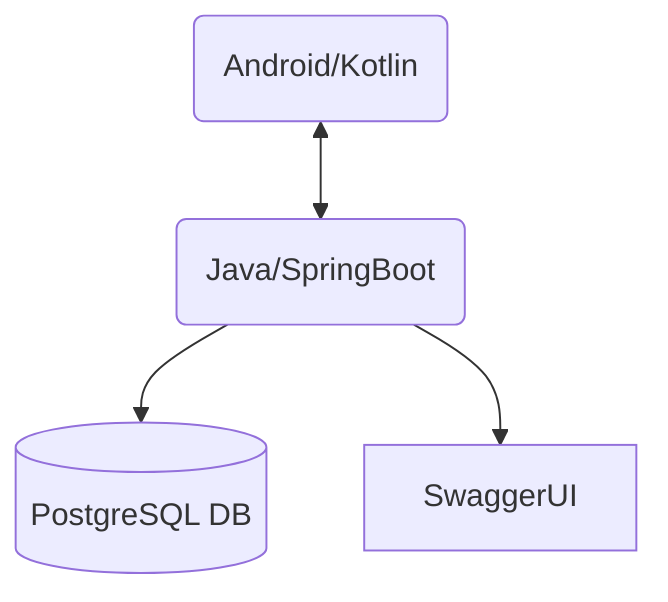

# 🧠 AlzAware Application

AlzAware is a comprehensive platform designed to assist Alzheimer's patients, their caregivers, and medical professionals. The project consists of a **mobile application** (Android/Kotlin) and a **backend API** (Java/Spring Boot), working together to provide medication management, safe location tracking, geofencing, and real-time patient monitoring.

---

## 📑 Table of Contents
- [Project Overview](#project-overview)
- [Architecture](#architecture)
- [Features](#features)
- [User Flows](#user-flows)
- [API Endpoints](#api-endpoints)
- [Notification & Geofencing Logic](#notification--geofencing-logic)
- [Technologies Used](#technologies-used)
- [Setup Instructions](#setup-instructions)
- [Contribution](#contribution)
- [License](#license)

---

## 📝 Project Overview
AlzAware aims to:
- Help caregivers and doctors monitor Alzheimer's patients remotely
- Enable patients to manage their medications and share their location
- Provide geofencing and safe zone alerts
- Facilitate communication between patients, caregivers, and medical staff

---

## 🏗️ Architecture



- **Mobile App:** Android application for patients and caregivers
- **Backend API:** RESTful API for authentication, data management, and notifications
- **Database:** PostgreSQL for persistent storage

### 🔄 Data Flow
1. **User Authentication:**
   - Mobile app sends login/signup requests to backend
   - Backend returns JWT token for authenticated sessions
2. **Medication & Location Management:**
   - Patients/caregivers manage medications, safe locations, and geofences via the app
   - All data is stored and retrieved via REST API endpoints
3. **Notifications & Reminders:**
   - Mobile app schedules local notifications for medication reminders
   - Backend can trigger alerts for geofence breaches

---

## ✨ Features

### 👤 Patient Features
- **Registration & Login:** Secure authentication with role selection
- **Medication Management:**
  - View, add, edit, and delete medications
  - Receive reminders for medication times (morning, afternoon, evening)
- **Profile Management:** View and update personal information
- **Location Sharing:**
  - Share real-time location with caregivers
  - Automatic periodic location updates
- **Safe Locations:**
  - View and add safe locations (e.g., home, hospital)
  - Delete safe locations
- **Geofence Awareness:**
  - View geofence set by caregiver
  - Receive alerts if outside safe zone

### 🧑‍⚕️ Caregiver Features
- **Registration & Login:** Secure authentication with role selection
- **Patient Management:**
  - Assign patients to caregiver
  - View list of assigned patients
  - Access patient details (profile, medications, locations)
- **Real-Time Location Tracking:**
  - View latest location of each patient
  - Map integration for visualization
- **Geofence Management:**
  - Set and update geofence (safe zone) for each patient
  - Receive alerts if patient leaves safe zone
- **Safe Location Management:**
  - View, add, and delete safe locations for patients
- **Medication Management:**
  - View and manage patient medications
- **Profile Management:** View and update caregiver profile

### 🩺 Admin/Doctor Features
- **Role-based Access:**
  - (Extendable) View patient and caregiver data
  - Manage users and permissions (future scope)

---

## 🗺️ User Flows

### 1️⃣ Registration & Login
- **Role Selection:** On first launch, user selects role (Patient or Caregiver)
- **Registration:**
  - Fill in required fields (username, email, password, etc.)
  - Submit to backend via `/api/auth/signup`
- **Login:**
  - Enter credentials
  - Authenticate via `/api/auth/login`
  - JWT token is stored for session

### 2️⃣ Patient Home Flow
- **Medication Tab:**
  - List all medications
  - Add/Edit/Delete medication
  - Set reminders for each medication
- **Profile Tab:**
  - View and update personal info
- **Location Sharing:**
  - App requests location permissions
  - Periodically sends location to backend
- **Safe Locations:**
  - View/add/delete safe locations on map
- **Geofence Awareness:**
  - View geofence on map
  - Receive alert if outside geofence

### 3️⃣ Caregiver Home Flow
- **Patient List:**
  - View all assigned patients
  - Add new patient by assignment
- **Patient Detail:**
  - Tabs for Medications, Safe Locations, Real-Time Location, Profile
- **Geofence Management:**
  - Set/update geofence for patient on map
- **Safe Location Management:**
  - Add/delete safe locations for patient
- **Profile:**
  - View and update caregiver info

---

## 📡 API Endpoints

### 🔐 Authentication
| Endpoint                | Method | Description           |
|------------------------|--------|-----------------------|
| `/api/auth/signup`     | POST   | Register new user     |
| `/api/auth/login`      | POST   | User login            |

### 💊 Medication Management
| Endpoint                              | Method | Description                       |
|----------------------------------------|--------|-----------------------------------|
| `/api/medicines/create`                | POST   | Create new medicine               |
| `/api/medicines/getMedicines/{pid}`    | GET    | List medicines for patient        |
| `/api/medicines/getAMedicine/{id}`     | GET    | Get medicine by ID                |
| `/api/medicines/updateMedicine/{id}`   | PUT    | Update medicine                   |
| `/api/medicines/deleteMedicine/{id}`   | DELETE | Delete medicine                   |

#### Example: Create Medicine
```json
POST /api/medicines/create
{
  "name": "Aspirin",
  "inMorning": 1,
  "inAfternoon": 0,
  "inEvening": 1,
  "usage": 0,
  "count": 2,
  "patient": { "id": 1 }
}
```

### 🏠 Safe Location Management
| Endpoint                                   | Method | Description                       |
|---------------------------------------------|--------|-----------------------------------|
| `/api/safe-location/add`                    | POST   | Add safe location                 |
| `/api/safe-location/patient/{patientId}`    | GET    | List safe locations for patient   |
| `/api/safe-location/delete/{locationId}`    | DELETE | Delete safe location              |

### 📍 Geofence Management
| Endpoint                        | Method | Description                       |
|----------------------------------|--------|-----------------------------------|
| `/api/geofence/save`             | POST   | Save or update geofence           |
| `/api/geofence/{patientId}`      | GET    | Get geofence for patient          |

#### Example: Save Geofence
```json
POST /api/geofence/save
{
  "patientId": 1,
  "latitude": 40.123,
  "longitude": 29.456,
  "radius": 200,
  "name": "Home Zone"
}
```

### 🗺️ Patient Location
| Endpoint                           | Method | Description                       |
|-------------------------------------|--------|-----------------------------------|
| `/api/patients/{id}/location`       | POST   | Update patient location           |
| `/api/patients/{id}/location`       | GET    | Get latest patient location       |

#### Example: Update Patient Location
```json
POST /api/patients/1/location
{
  "latitude": 40.123,
  "longitude": 29.456
}
```

---

## 🔔 Notification & Geofencing Logic

### 💊 Medication Reminders
- Medications are scheduled with time slots (morning, afternoon, evening)
- The mobile app uses Android's WorkManager and AlarmManager to schedule local notifications
- When it's time to take a medication, a notification is shown to the patient
- Patients/caregivers can mark medications as taken

### 🛡️ Geofencing & Safe Zones
- Caregivers set a geofence (center + radius) for each patient
- The mobile app monitors the patient's location in the background
- If the patient leaves the geofenced area, an alert/notification is triggered
- Safe locations can be added (e.g., home, hospital) and visualized on the map

### 📡 Real-Time Location Sharing
- Patients' devices periodically send their location to the backend
- Caregivers can view the latest location of each patient on a map

---

## 🛠️ Technologies Used

### 📱 Mobile (Android)
- **Kotlin**: Main programming language
- **AndroidX**: Modern Android components
- **Google Maps SDK**: Map and geolocation features
- **Retrofit**: HTTP client for API communication
- **WorkManager & AlarmManager**: Background tasks and reminders
- **Material Design**: UI/UX components

### ☕ Backend
- **Java 21**: Main programming language
- **Spring Boot**: REST API framework
- **Spring Security**: Authentication and authorization
- **JPA/Hibernate**: ORM for database access
- **PostgreSQL**: Relational database
- **Swagger/OpenAPI**: API documentation

### 🛠️ Other
- **Gradle**: Build tool for Android
- **Maven**: Build tool for backend

---

## ⚡ Setup Instructions

### Backend Setup
1. **Prerequisites:** Java 21, Maven, PostgreSQL
2. **Database Setup:**
   ```sh
   cd backend
   ./setup_db.sh
   ```
3. **Build & Run:**
   ```sh
   mvn clean install
   mvn spring-boot:run
   ```
4. **API Docs:** [http://localhost:8080/swagger-ui.html](http://localhost:8080/swagger-ui.html)

### Mobile App Setup
1. **Prerequisites:** Android Studio, Android device/emulator
2. **Open Project:** Open `AlzAwareMobile` in Android Studio
3. **Sync Gradle:** Let dependencies resolve
4. **Configure API URL:** (if needed) in `ApiClient.kt`
5. **Run App:** Build and run on device/emulator

---

## 🤝 Contribution
1. Fork the repository
2. Create a new branch (`feature/your-feature`)
3. Commit your changes
4. Push to your branch
5. Open a Pull Request

### Guidelines
- Write clear commit messages
- Document new features and code
- Add tests where possible
- Ensure code passes lint and builds

---

## 📄 License
This project is for educational and research purposes. For commercial use, please contact the authors.